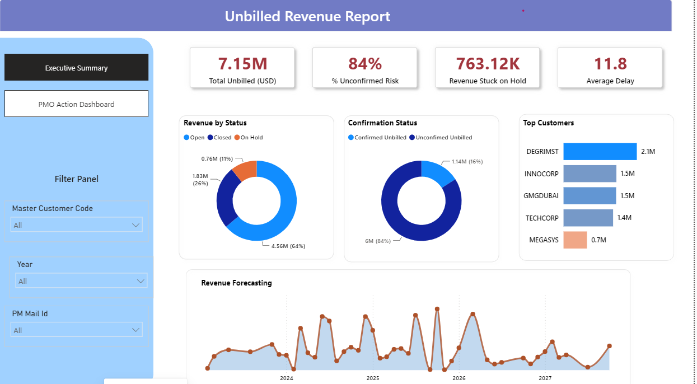

<h1 align="center">Unbilled Revenue Report_Dashboard</h1>

**Problem Statment**

Our goal is to analyze the unbilled revenue data to track outstanding amounts,identify confirmation risks and get insights from this dataset.

## Data Source
Unbilled revenue and customer billing records including status (Open/Closed/On Hold), confirmation status, customer codes, and delay metrics.

## Tools & Skills Used
Power BI | DAX | Power Query | Data Modeling | Risk Analysis | Executive Reporting | Interactive Dashboards

## Insights derived from the data:

* DEGRIMST is the top customer for unbilled revenue where as Client E holds the least amount among the top five.
* The open status holds the maximum unbilled revenue whereas the On Hold status holds the maximum value.
* Unconfirmed unbilled is the highest risk factor, making up 84% of the confirmation status.
* The unbilled revenue is $7.15M with an average delay of 11.8.
* A total of $763.12K in revenue is currently stuck on hold.

## Business Impact
With 84% of unbilled revenue flagged as unconfirmed, this dashboard highlights a significant collections risk that could delay cash flow if left unaddressed. The PMO Action Dashboard view enables finance/PMO teams to prioritize follow-ups by customer and status, focus first on high-value accounts like Clent A, and reduce the $763K currently stuck on hold — directly supporting faster revenue recognition and improved cash flow visibility.

